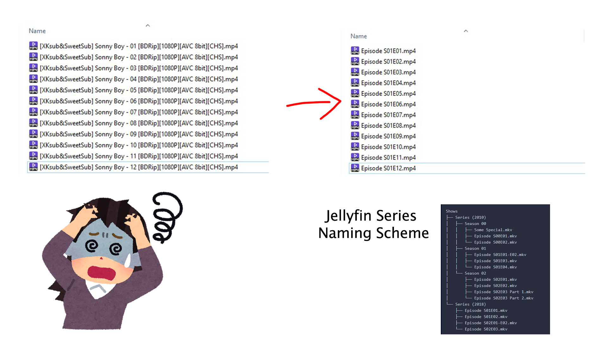
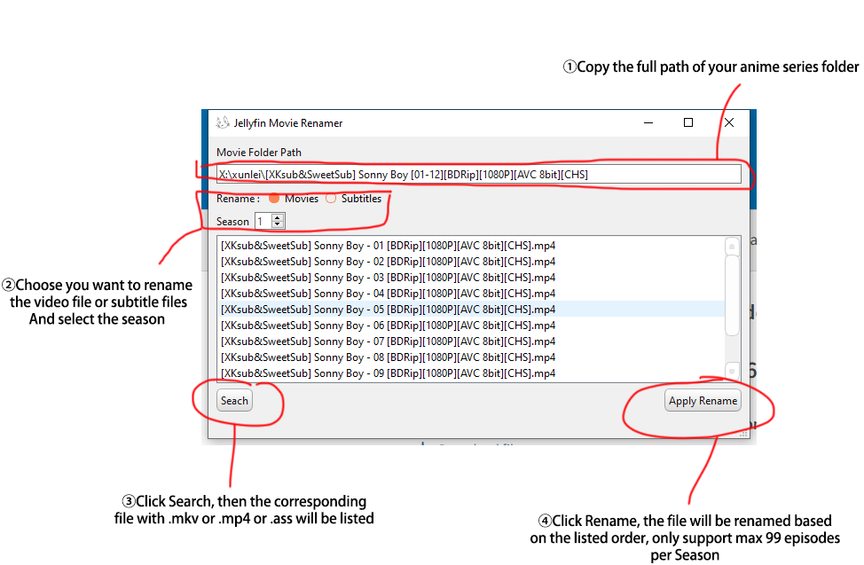

# jellyfin_renamer
Rename your anime series to the Jellyfin format

## What is it for?
Are you tired of manually renaming hundreds of your series files to the Jellyfin naming scheme? 
This tool may help you.


## How to use


QSS style sheet from :
```
@software{QSS,
  author = {Jaime Quiroga},
  month = {5},
  title = {{QT Style Sheets templates}},
  url = {https://github.com/GTRONICK/QSS},
  version = {v1.1.0},
  year = {2021}
}
```
